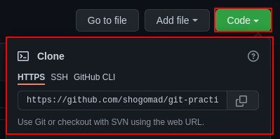
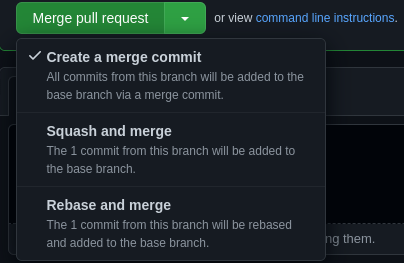

# git-practice

## Projet local
### Initialiser un dépôt local
- Créer un répertoire et se placer à l'intérieur de celui-ci  
  Exemple : `mkdir my-awesome-project && cd "$_"`
- La commande `git init` va créer un répertoir spéciale `.git`, c'est un squelette de dépôt géré par Git.
- Ajouter les premiers fichiers de ce merveilleux nouveau projet, comme par example un readme  
  `touch README.md && git add "$_"`
- Il faut maintenant commit ce nouveau fichier avec `git commit -m "feat: Initial commit"` par exemple

### Récupérer un dépôt existant
- Récupérer l'adresse du dépôt, par exemple sur GitHub :  
  
- Se positionner dans un répertoire au choix
- Cloner le dépôt avec la commande `git clone URL`
  - Il est possible de faire cela avec ssh également

### Ajouter un fichier à un dépôt
- Ajouter un fichier dans le dépôt
- Vérifier l'état du dépôt avec un `git status`
- Que remarque-t-on ?
- Ajouter le fichier à la Staging Area avec `git add NOM_DU_FICHIER`
- Vérifier l'état du dépôt avec un `git status`
- Constater le changement d'état

### Commit son changement
Le fichier est dans la Stagin Area, il est maintenant pris en charge par Git.
Mais le snapshot associé à ce fichier n'est pas encore dans le répertoire Git, il va falloir commit pour cela
- `git commit -m "MESSAGE"`
- Vérifier l'état du dépôt avec un `git status`
- Observer le changement
- Publier la mise à jour avec `git push`
- Vérifier l'état du dépôt avec un `git status`
- Regarder l'historique avec `git log`
- Aller sur le dépôt GitHUB et constater que le fichier est bien présent

### Travailler avec un branche
Nous avons travaillé directement dans la branche `main`, ce qui n'est pas une bonne pratique sur un dépôt partagé. 
Il est de bon usage de travailler avec une branche.
- Créer une branche sur le dépôt avec `git branch NOM_DE_BRANCHE`
> :warning: **ATTENTION** La branche que nous allons créer aura les versions de fichiers de la branche sur laquelle nous sommes au moment de lancer la commmande.  
> i.e. Si nous lançons la commande à partir de `main`, la branche sera "parente" de `main` (version de fichiers de `main`), mais si nous lançons à partir d'un autre branche, elle sera parente de celle-ci (donc avec potentiellement pas les mêmes versions de fichiers que `main`)
- Vérifier que la branche a bien été créée avec `git branch`

La branche a été créée, mais nous ne somme pas dessus par défaut.
- Changer de branche avec `git checkout NOM_DE_BRANCHE`
- Ouvrir le fichier créé précédemment et y ajouter du texte
- Sauvegarder et faire `git add NOM_DU_FICHIER` puis `git commit -m "MESSAGE"`
- Maintenant, faire un `git checkout main`
- Ouvrir le fichier
- Que remarque-t-on ?
- Lancer la commande `git diff NOM_DE_BRANCHE`

La modification n'est présente que dans la branche, pas dans `main`

### Publier la branche et faire une Pull Request (PR)

- `git push -u origin NOM_DE_BRANCHE`
- Aller sur le dépôt GitHUB, et observer le changement
- Cliquer créer une Pull Request
- Regarder les changements
- La requête est créé mais le changement n'est toujours pas publié sur main
- Avant de Merge la Pull Request, cliquer sur la flèche et étudier les différentes options  

- Choisir Squash and merge et finaliser la Pull Request
- Sur le dépôt sur notre poste, aller sur la branche `main` avec `git checkout main`
- Regarder le contenu du fichier modifié, que voit-on ?
- Lancer la commande `git pull`
- Quel changement est apparu ?
